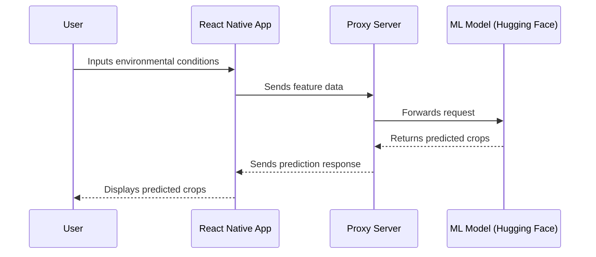

<p align="center">
  
</p>

# Meadow AI - Crop Prediction System

## Overview

Meadow AI is a machine learning-powered crop prediction system designed to help small-scale farmers make data-driven decisions. The system consists of a **React Native** application that collects relevant features and predicts the most probable crop labels by communicating with a **proxy server**, which in turn interacts with a deployed machine learning model on **Hugging Face**.

## Architecture

The solution follows the **MVVM (Model-View-ViewModel) architecture** in the React Native app, ensuring separation of concerns and maintainability. It includes:

- **React Native App (Frontend)**: Collects user input, processes feature data, and displays crop predictions.
- **Proxy Server (Backend API)**: Acts as an intermediary between the app and the model, handling requests and responses.
- **ML Model (Hosted on Hugging Face)**: Receives feature data, processes it, and returns predictions.

### Data Flow


1. The user inputs relevant environmental conditions into the **React Native app**.
2. The app generates feature data and sends a request to the **proxy server**.
3. The **proxy server** forwards the request to the **machine learning model on Hugging Face**.
4. The **ML model** processes the request and returns the most probable crop labels.
5. The **proxy server** relays the response back to the **React Native app**.
6. The app displays the predicted crops to the user.

## Technologies Used

- **Frontend**: React Native (MVVM architecture)
- **Backend**: Node.js/Express (Proxy Server)
- **Machine Learning**: XGBoost, KNN, Random Forest (Hosted on Hugging Face)
- **Deployment**: Hugging Face for model hosting
- **Data**: CSV-based dataset from Meedow AI’s repository

## Installation & Setup

### Prerequisites

- Node.js & npm
- React Native CLI & dependencies
- Python (for ML model development)

### Steps

1. **Clone the Repository**
_(You will need access from project owners)_
   ```sh
   git clone https://github.com/MeedowDev/MeedowAI.git
   cd MeedowAI
   ```

2. **Set Up the React Native App**

   ```sh
   cd frontend
   npm install
   npx react-native start
   ```

3. **Set Up the Proxy Server**

   ```sh
   cd backend
   npm install
   node server.js
   ```

4. **Model Deployment on Hugging Face**

   - The trained model is already deployed on Hugging Face.
   - Update the proxy server’s `.env` file with the model API URL.

## API Endpoints

| Method | Endpoint   | Description                                     |
| ------ | ---------- | ----------------------------------------------- |
| POST   | `/predict` | Sends feature data and returns crop predictions |

### Sample Request

```json
{
  {
  "h_mean_Q1": 73.6590909090909,
  "h_mean_Q2": 70.75,
  "h_mean_Q3": 73.88636363636364,
  "h_mean_Q4": 73.52272727272727,
  "r_sum_Q1": 1.0618181818181816,
  "r_sum_Q2": 1.8875000000000002,
  "r_sum_Q3": 0.7829545454545453,
  "r_sum_Q4": 0.4690909090909087,
  "t_max_Q1": 29.5,
  "t_max_Q2": 30.1,
  "t_max_Q3": 27.8,
  "t_max_Q4": 25.1,
  "t_mean_Q1": 26.263636363636362,
  "t_mean_Q2": 26.577272727272728,
  "t_mean_Q3": 24.281818181818178,
  "t_mean_Q4": 22.382954545454538,
  "t_min_Q1": 8.8,
  "t_min_Q2": 14.7,
  "t_min_Q3": 11.8,
  "t_min_Q4": 12.6,
  "w_max_Q1": 11.2,
  "w_max_Q2": 10.9,
  "w_max_Q3": 9,
  "w_max_Q4": 8.8,
  "w_mean_Q1": 9.65454545454546,
  "w_mean_Q2": 8.752272727272725,
  "w_mean_Q3": 7.572727272727275,
  "w_mean_Q4": 7.082954545454546
}
}
```

### Sample Response

```json
{
  "data": [
    "Bananas_Nusu Ngombe: 62.00%Papaya_Kapoho: 61.00%Cassava_Kibandameno: 50.00%"
  ],
  "endpoint": "/predict",
  "fn_index": 0,
  "time": "2025-02-07T11:55:06.004Z",
  "type": "data"
}
```

## Future Improvements

- Optimize inference time.
- Improve model accuracy with more training data.
- Implement user authentication for personalized recommendations.

## Contributors

[Mark Victor](https://github.com/victorcodebase)
[steph](https://github.com/stephanjosh)

## License

This project is licensed under the MIT License.


## 🤖 Solution  
| Home Screen | Crop Prediction | Your Account |
|-------------|-----------------|--------------|
|  |  |  |


### Current Features:
✅ Tailored crop recommendations  
✅ Continuous guidance on cultivation practices  
✅ Crop selection tracking  
✅ Assistance in acquiring high-quality seeds  

## 🚀 Running the Project

### Prerequisites
Ensure you have the following installed:  
- [Node.js](https://nodejs.org/) (v12+ recommended)  
- [Expo CLI](https://docs.expo.dev/get-started/installation/)  
- [Git](https://git-scm.com/)  

### Cloning the Repository
```bash
git clone https://github.com/MeedowDev/Meadow-AI.git
cd Meadow-AI
